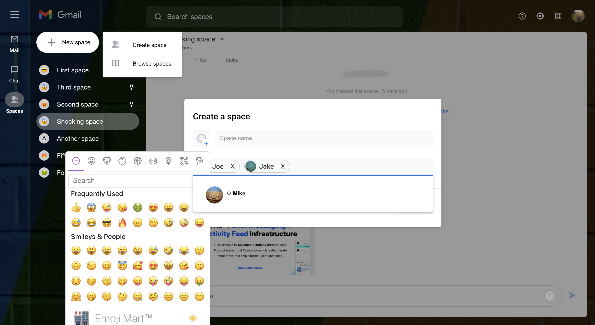

# stream-spaces

stream-spaces is a Gmail Spaces Clone built with Stream and the React SDK.



## Quick Links

- [Register](https://getstream.io/chat/trial/) to get an API key for your Stream App
- [React Chat SDK](https://github.com/GetStream/stream-chat-react)
- [React Chat Tutorial](https://getstream.io/chat/react-chat/tutorial/)

## What is Stream?

Stream allows developers to rapidly deploy scalable feeds and chat messaging with an industry-leading 99.999% uptime SLA guarantee. With Stream’s chat components, developers can quickly add chat to their app for a variety of use-cases:

- Livestreams like Twitch or Youtube
- In-Game chat like Overwatch or Fortnite
- Team style chat like Slack
- Messaging style chat like Whatsapp or Facebook’s messenger
- Commerce chat like Drift or Intercom

## Repo Overview 😎

This repo contains for source code for the [How to Code a Gmail Spaces Clone with React](https://getstream.io/blog/gmail-spaces-clone-react/) tutorial article on Stream's blog.

Supported functionalities in this clone include:

- Sign in using different user accounts
- Creating new spaces with add members functionality
- Navigating chat spaces with the URL
- Browsing spaces
- Pinning spaces
- Joining/Leaving spaces

## Requirements 🛠

- [Register](https://getstream.io/chat/trial/) and create a Stream app (you can call stream-spaces or whatever you want)
- [Install Node v16.13.1](https://nodejs.org/ru/blog/release/v16.13.1/) (16.13.1 is the version used for this project)

## Steps to Run Locally 🧑‍💻👩‍💻

- Clone this repo:

  ```bash
  git clone https://github.com/dillionmegida/stream-spaces
  ```

- Install dependencies:

  ```bash
  npm install
  ## or
  yarn
  ```

- Add the API key of your Stream app to [src/views/SpacesPage, line 13](./src/views/SpacesPage.js#L13)
- Start server:

  ```bash
  npm run start
  ```

Your Gmail Spaces clone will be live on `localhost:3000` and you can begin experimenting the functionalities or adding yours 😁

Kindly leave a star on the [React Chat SDK](https://github.com/GetStream/stream-chat-react) if you enjoyed the result of the tutorial :)
